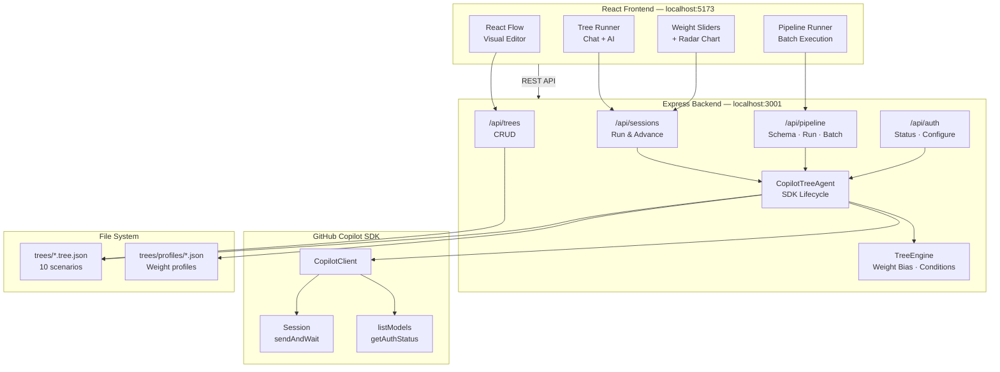
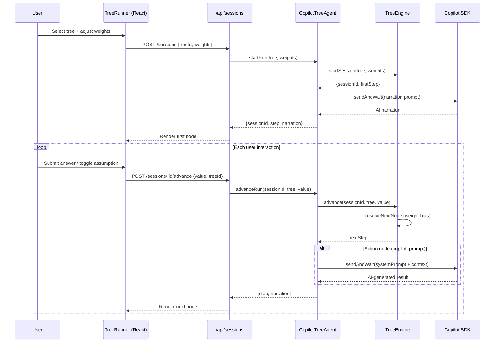

# Copilot Decision Tree 🌳🤖

A **Visual Decision Tree Builder** powered by the **GitHub Copilot SDK** that makes AI reasoning explicit, auditable, and reusable — so teams can guide AI decisions instead of hoping the defaults are right.

---

## The Problem: AI Assumes — Silently, Confidently, and Often Wrong

Every time you ask an AI coding assistant to "set up a new service" or "write a deployment pipeline," it makes dozens of hidden decisions for you. Which framework? What database? REST or GraphQL? Monolith or microservice? The AI picks whatever was most common in its training data and moves on — without telling you it made a choice, much less asking if that choice was right for *your* context.

This silent assumption problem compounds in real organizations:

### 🏥 Healthcare Startup — Wrong Compliance Assumption
A team asks Copilot to scaffold a patient records API. The AI generates a standard Express + PostgreSQL setup with JWT auth — perfectly reasonable defaults. But the team operates under **HIPAA**. There's no audit logging, no encryption-at-rest configuration, no BAA-aware infrastructure. The code looks complete and professional, so nobody catches it until a compliance review three months later. The AI never asked: *"Are you in a regulated industry?"*

### 🏦 Fintech Migration — Wrong Architecture Assumption
A developer asks for help migrating a monolithic payment service to the cloud. The AI assumes a lift-and-shift into containers because that's the most commonly documented migration pattern. But this particular service processes **50,000 transactions/second** — it actually needs an event-driven architecture with CQRS and dedicated message queues. The AI never surfaced *its own assumption* that container orchestration was the right path. The team discovers the bottleneck under load in staging.

### 🏢 Enterprise Platform Team — Inconsistent Decisions
Five teams in the same org ask Copilot to set up new microservices across a two-month sprint. Each team gets slightly different scaffolding: different logging libraries, different error handling patterns, different auth flows. None of it is *wrong*, but none of it is consistent. The platform team's standards doc exists in Confluence — the AI never saw it and never asked.

### 🚀 Incident Response — Wrong Triage Path
An SRE asks the AI to help debug a production outage. The AI suggests checking application logs first — the statistically most common root cause. But this particular failure is a **network partition** between availability zones. The AI's default triage path wastes 20 minutes looking at clean application logs while the real issue escalates. Nobody told the AI the system was multi-region.

### The Root Cause

The core issue isn't that AI is bad at coding — it's that **AI has no structured way to surface its assumptions, ask the right questions, or follow organization-specific reasoning paths.** It guesses, and it guesses silently. In low-stakes scenarios this works fine. In production, regulated, or complex environments, silent assumptions aren't just inconvenient — they're dangerous.

---

## The Solution: Guided Decision Trees for AI Reasoning

**Copilot Decision Tree** solves this by giving teams a visual way to structure the reasoning path AI should follow — *before* it generates code. Instead of a single prompt producing a single guess, the AI walks an explicit decision tree that:

1. **Asks the right questions** — Input nodes gather the context AI would otherwise assume
2. **Surfaces assumptions** — Assumption nodes make hidden defaults visible and confirmable
3. **Branches on real conditions** — Decision nodes route to different outcomes based on actual answers, not statistical defaults
4. **Produces context-aware actions** — Action nodes generate code/config that reflects the *specific* situation

Think of it as a **runbook for AI** — a reusable, version-controlled, auditable reasoning path that ensures the AI asks before it assumes.

### How a Decision Tree Changes the Outcome

**Without a tree** (traditional prompt):
> "Set up a new API service" → AI picks Express + REST + JWT + PostgreSQL + Docker. Maybe that's right. Maybe not. You won't know what it skipped.

**With a tree** (guided reasoning):
> Tree asks: *What's your compliance environment?* → HIPAA → Tree asks: *What's your expected throughput?* → Low → Tree recommends: Express + REST + encrypted PostgreSQL + audit logging + HIPAA-compliant infrastructure template. Every choice documented, every assumption confirmed.

The same tree works for every team in the org. The same tree works six months from now. The same tree surfaces exactly where your last incident went wrong.

---

## Node Types

Copilot Decision Tree structures reasoning into four node types:

- **🟦 Input Nodes** — Gather data or context from the user before deciding. Supports **text**, **choice**, **number**, **boolean**, and **image upload** input types.
- **🟨 Assumption Nodes** — Explicit assumptions the AI would otherwise make silently, surfaced for confirmation. Each assumption can carry **weight influence** that shifts the decision weights when toggled.
- **🟩 Decision Nodes** — Branching logic based on real conditions and weighted criteria. Support **weight bias** to favor specific branches based on domain-specific priorities.
- **🟥 Action Nodes** — Copilot SDK–powered actions that generate context-aware results. Can be **terminal** (end of path) or **non-terminal** with feedback loops that route back into the tree.

---

## Key Capabilities

### 🎛️ Weight System
Every tree defines its own **domain-specific weight dimensions** (e.g., "Patient Safety", "Cost Consciousness" for a medical tree or "Flight Safety", "Engine Performance" for aviation). Users adjust sliders before or during a run to shift how the AI prioritizes trade-offs. Weights propagate through:
- **Assumption nodes** → `weightInfluence` increases or decreases a dimension when the assumption is toggled
- **Decision nodes** → `weightBias` favors specific branches based on current weight values
- **Radar chart** → Live visualization of the current weight profile

### 🔄 Feedback Loops
Action nodes are no longer dead ends. When an action node has outgoing edges, it becomes **non-terminal** — Copilot generates its diagnosis/recommendation, then presents feedback choices:
- **✓ Problem Fixed / Diagnosis Confirmed** → routes forward to treatment, resolution, or preventive care
- **✗ Not Improving / Inconclusive** → routes to reassessment, additional workup, or specialist referral
- **🚨 Acute Deterioration** → routes to emergency escalation

This enables iterative clinical workflows, multi-pass troubleshooting, and waterfall diagnostic patterns.

### 🖼️ Image Upload
Input nodes support an `"image"` input type for visual data — upload skin lesion photos, X-rays, oscilloscope captures, architecture diagrams, or any visual artifact. The image reference is stored in the session context and passed to Copilot SDK prompts.

### ⚡ Pipeline Runner (Headless Batch Execution)
Beyond the interactive chat interface, every tree can be run as a **headless pipeline**:

1. **Schema extraction** — `GET /api/pipeline/schema/:treeId` returns all input fields, types, and defaults as a structured form
2. **Single run** — `POST /api/pipeline/run` accepts all inputs + weights at once, walks the entire tree without user interaction, fires Copilot SDK at every action node, and returns a full trace
3. **Batch run** — `POST /api/pipeline/batch` runs multiple input sets concurrently with configurable parallelism

Pipeline output includes a **full execution trace** — every node visited, every decision made, every Copilot response — making runs auditable and reproducible.

### 🗺️ Auto-Layout
Trees are automatically arranged using a **dagre left-to-right layout** engine with adaptive spacing. Nodes are sized based on content, and the layout adjusts for sibling density. Custom layouts can be saved per tree.

---

## Architecture



### Data Flow: Interactive Tree Run



## Quick Start

```bash
# Install dependencies
npm install

# Create a .env file in /server
cp server/.env.example server/.env
# Add your GitHub token

# Run both frontend and backend
npm run dev
```

- **Frontend**: http://localhost:5173
- **Backend**: http://localhost:3001

## Project Structure

```
├── client/                    # React + Vite frontend
│   └── src/
│       ├── components/
│       │   ├── TreeNodes.tsx       # 4 node types (Input, Assumption, Decision, Action)
│       │   ├── NodeEditor.tsx      # Property editor with weight bias/influence
│       │   ├── TreeRunner.tsx      # Interactive chat-based tree runner
│       │   ├── PipelineRunner.tsx  # Headless batch pipeline UI
│       │   ├── WeightsRadar.tsx    # Radar chart + weight sliders
│       │   └── Sidebar.tsx         # Tree list, weight CRUD, tree management
│       ├── weight-utils.ts    # Weight dimension utilities
│       ├── api.ts             # REST client (tree, session, pipeline)
│       └── types.ts           # Shared TypeScript types
├── server/                    # Express + Copilot SDK backend
│   └── src/
│       ├── agent.ts           # Copilot SDK agent — fires at every action node
│       ├── tree-engine.ts     # Decision tree interpreter with weight engine
│       ├── routes.ts          # REST API (trees, sessions, pipeline)
│       └── types.ts           # Server-side types
├── trees/                     # 10 scenario .tree.json files
└── package.json               # npm workspaces root
```

## How It Works

### 1. Build a Tree (Visual Editor)
Drag and drop nodes onto the canvas. Connect them to create decision paths. Each node type has a specific role:

| Node | Purpose | Example |
|------|---------|---------|
| 🟦 Input | Gather data from user | "What programming language?" / image upload |
| 🟨 Assumption | State an explicit assumption | "Assumes production environment" (toggleable, shifts weights) |
| 🟩 Decision | Branch on a condition | "Is there a database?" → Yes / No (weight-biased) |
| 🟥 Action | Copilot SDK action | "Generate REST API boilerplate" (terminal or feedback loop) |

### 2. Run a Tree (Chat Interface)
The Copilot SDK agent loads the tree and walks through it conversationally:
- Asks questions at **Input** nodes (text, choice, number, boolean, or image)
- Confirms **Assumption** nodes with the user (toggling shifts weights)
- Evaluates **Decision** branches based on collected context and weight bias
- Executes **Action** nodes with Copilot SDK — non-terminal actions present feedback choices to continue

### 3. Run a Pipeline (Headless Batch)
Fill in all inputs at once and execute the entire tree without interaction:
- Copilot SDK fires at every action node along the path
- Full execution trace shows every node visited and every decision made
- Batch mode runs multiple input sets concurrently for regression testing or comparison

### 4. Share & Version Control
Trees are stored as `.tree.json` files — commit them to your repo, share with your team, and iterate. Each tree includes its own weight dimensions, metadata, and layout preferences.

---

## Scenario Library (10 Trees)

### Software Engineering

| Tree | Nodes | Edges | Weights | Description |
|------|-------|-------|---------|-------------|
| **Architecture Guide** | 13 | 13 | 8 | Message queue vs. event stream selection — weights include Reliability, Budget Constraint, Tech Innovation, Security Posture |
| **Tech Stack Selector** | 16 | 17 | 8 | Greenfield project stack decisions — weights include Learning Curve, Ecosystem Maturity, Type Safety, Performance Focus |
| **Deployment Troubleshooter** | 14 | 13 | — | Diagnoses common deployment failures — CI/CD, container, DNS, and permissions paths |
| **App Modernization** | 14 | 13 | 8 | Legacy app migration strategy (6Rs: Rehost → Rearchitect) — weights include Migration Risk, Cloud Cost, Delivery Speed |
| **Codex Spec Builder** | 35 | 60 | 8 | AI coding spec generation (AGENTS.md, Starlark rules, prompt templates, multi-agent config) — 18 feedback loops, weights include Spec Precision, Token Efficiency, Code Creativity, Human Oversight |

### Operations & Risk

| Tree | Nodes | Edges | Weights | Description |
|------|-------|-------|---------|-------------|
| **Credit Risk Decision** | 16 | 20 | 8 | Risk-based lending decisions — weights include Default Risk, Regulatory Weight, Fraud Detection, Collateral Weight |

### Diagnostics & Incident Response (with Feedback Loops)

| Tree | Nodes | Edges | Feedback Edges | Weights | Description |
|------|-------|-------|----------------|---------|-------------|
| **Incident Response** | 27 | 55 | 8 | 8 | SRE incident triage runbook — war room setup, rollback decision, infrastructure/application/dependency investigation, escalation, remediation with retry loops, blameless post-mortem, preventive measures — weights include Severity Bias, Blast Radius, Recovery Speed, Automation Trust |
| **Medical Symptom & Diagnosis** | 40 | 79 | 50 | 8 | Full clinical decision support — 7 body systems (cardiovascular, neurological, GI, respiratory, MSK, dermatological, systemic), triage, differential diagnosis, lab/imaging interpretation, treatment planning, medication review, mental health screening, feedback loops for treatment monitoring |
| **Automotive Diagnosis** | 38 | 37 | 24 | 6 | Vehicle diagnostics — CAN bus, engine, transmission, electrical, braking, HVAC, suspension with OBD-II code analysis and image upload for oscilloscope captures |
| **Airplane Diagnosis** | 14 | 13 | — | 8 | Aircraft maintenance fault isolation — weights include Flight Safety, Avionics Integration, Engine Performance, Regulatory Compliance |

### Medical Tree Deep Dive 🏥

The **Medical Symptom & Diagnosis** tree is the most comprehensive scenario, designed to demonstrate clinical decision support:

**Intake (9 inputs):** Primary symptom category → duration/onset → demographics → pain scale (0–10) → vital signs → medical history & medications → associated symptoms → lifestyle & social history → clinical image upload

**Triage:** Emergency / Urgent / Routine classification with red flag screening (sudden worst headache, hemodynamic instability, altered consciousness, acute neuro deficit, signs of sepsis)

**System-specific workups:** Each of the 7 body systems has a dedicated Copilot prompt that generates:
- Top 3 differential diagnoses ranked by probability
- Evidence-based clinical scores (HEART, Wells, CURB-65, NIH Stroke Scale, ABCDE criteria)
- Ordered diagnostic tests (labs → imaging → invasive)
- Red flags requiring immediate specialist consult

**Feedback loops:** Every workup routes to one of three paths:
- ✓ **Diagnosis Confirmed** → Chronic vs Acute decision → Treatment Plan or Chronic Management
- ? **Need More Tests** → Additional Workup → Lab Interpretation → Imaging Review
- ✗ **Refer to Specialist** → Specialist Referral with SBAR handoff

**Treatment monitoring:** Treatment Plan → Improving (preventive care) / Side Effects (medication review → allergy assessment) / Not Improving (reassessment → new diagnosis or escalation)

**Safety nets:** Reassessment can loop back to treatment, escalate to specialist, or trigger emergency protocol. Emergency protocol routes to stabilization or ER transfer.

**8 clinical weights:** Patient Safety · Diagnostic Urgency · Test Invasiveness · Cost Consciousness · Differential Breadth · Evidence Strength · Specialist Threshold · Holistic Care

---

## Enterprise Use Cases

| Use Case | Problem Without Trees | With Copilot Decision Tree |
|----------|----------------------|---------------------------|
| **Onboarding** | New engineers get inconsistent AI-generated scaffolding with no guardrails | Guided trees walk them through org-specific standards step by step |
| **Incident Response** | AI suggests generic triage (check logs first) regardless of system topology | Trees branch on infrastructure type, region, and failure mode to find root cause faster |
| **Architecture Reviews** | Reviewers manually verify AI considered the right constraints | Trees enforce that compliance, throughput, and team-size questions are asked before recommendations |
| **Compliance** | AI silently skips regulatory requirements it doesn't know about | Assumption nodes force explicit confirmation of regulatory environment before any code is generated |
| **Platform Consistency** | Five teams get five different patterns from the same AI | Shared decision trees ensure every team follows the same reasoning path |
| **Clinical Decision Support** | AI gives generic medical advice disconnected from patient data | Trees enforce structured intake, triage, system-specific workups, and evidence-based scoring |
| **Regression Testing** | Manual re-runs after tree changes to verify behavior | Pipeline batch mode runs multiple input sets concurrently and compares traces |
| **Audit & Reproducibility** | No record of what the AI considered or decided | Full execution trace captures every node visited, every decision made, every weight applied |

## API Reference

Base URL: `http://localhost:3001/api`

### Authentication & Models
| Method | Endpoint | Description |
|--------|----------|-------------|
| `GET` | `/api/auth/status` | Current auth status + SDK config |
| `POST` | `/api/auth/configure` | Reconfigure credentials / model |
| `GET` | `/api/models` | List available Copilot models |

<details>
<summary><strong>POST /api/auth/configure</strong> — Request & Response</summary>

```json
// Request
{
  "githubToken": "ghp_...",       // optional — explicit token
  "useLoggedInUser": true,         // use gh CLI / OAuth (default)
  "model": "gpt-4o"                // optional — override model
}
// Response (same as GET /api/auth/status)
{
  "isAuthenticated": true,
  "authType": "oauth",
  "login": "octocat",
  "host": "github.com",
  "config": { "useLoggedInUser": true, "hasToken": false, "model": "gpt-4o" }
}
```
</details>

### Tree CRUD
| Method | Endpoint | Description |
|--------|----------|-------------|
| `GET` | `/api/trees` | List all trees (full objects) |
| `GET` | `/api/trees/:id` | Get a single tree by ID or filename |
| `POST` | `/api/trees` | Create a new tree (auto-generates UUID) |
| `PUT` | `/api/trees/:id` | Update an existing tree |

<details>
<summary><strong>POST /api/trees</strong> — Create a tree</summary>

```json
// Request
{
  "name": "My Decision Tree",
  "description": "Helps choose the right approach",
  "version": "1.0.0",
  "rootNodeId": "input_start",
  "tags": ["example"],
  "nodes": [ /* see Tree Authoring Guide below */ ],
  "edges": [ /* see Tree Authoring Guide below */ ],
  "defaultWeights": [ /* see Weight Dimensions below */ ]
}
// Response: 201 Created — full tree object with generated id, createdAt, updatedAt
```
</details>

### Interactive Sessions
| Method | Endpoint | Description |
|--------|----------|-------------|
| `POST` | `/api/sessions` | Start a new tree run session |
| `POST` | `/api/sessions/:sessionId/advance` | Submit user input, get next step |
| `GET` | `/api/sessions/:sessionId` | Get current session state |
| `PUT` | `/api/sessions/:sessionId/weights` | Update weights mid-session |

<details>
<summary><strong>POST /api/sessions</strong> — Start a session</summary>

```json
// Request
{
  "treeId": "tech-stack-selector",
  "weights": [                     // optional — override tree defaults
    { "id": "learningCurve", "value": 70 }
  ],
  "initialContext": {}              // optional — pre-fill variables
}
// Response
{
  "sessionId": "a1b2c3d4-...",
  "step": {
    "nodeId": "input_project_type",
    "nodeType": "input",
    "message": "What type of project are you building?",
    "prompt": "Select your project type",
    "choices": ["Web App", "API Service", "CLI Tool"],
    "inputType": "choice",
    "isTerminal": false
  },
  "narration": "Let's find the right tech stack for your project..."
}
```
</details>

<details>
<summary><strong>POST /api/sessions/:sessionId/advance</strong> — Advance</summary>

```json
// Request
{
  "value": "Web App",
  "treeId": "tech-stack-selector"
}
// Response
{
  "step": {
    "nodeId": "decision_complexity",
    "nodeType": "decision",
    "message": "Based on your inputs, evaluating complexity...",
    "isTerminal": false
  },
  "narration": "Given your team's experience and the Web App focus..."
}
```
</details>

### Pipeline (Headless Batch Execution)
| Method | Endpoint | Description |
|--------|----------|-------------|
| `GET` | `/api/pipeline/schema/:treeId` | Discover all input fields, types, and defaults |
| `POST` | `/api/pipeline/run` | Run tree end-to-end with pre-filled inputs |
| `POST` | `/api/pipeline/batch` | Run multiple input sets concurrently |

<details>
<summary><strong>GET /api/pipeline/schema/:treeId</strong> — Schema discovery</summary>

```json
// Response
{
  "treeId": "tech-stack-selector",
  "treeName": "Tech Stack Selector",
  "description": "Helps teams choose the right technology stack...",
  "fieldCount": 4,
  "fields": [
    {
      "variableName": "project_type",
      "label": "Project Type",
      "prompt": "What type of project?",
      "inputType": "choice",
      "choices": ["Web App", "API Service", "CLI Tool"],
      "default": "Web App",
      "nodeId": "input_project_type",
      "required": true
    }
  ]
}
```
</details>

<details>
<summary><strong>POST /api/pipeline/run</strong> — Single pipeline run</summary>

```json
// Request
{
  "treeId": "tech-stack-selector",
  "inputs": {
    "project_type": "Web App",
    "team_size": "5-10",
    "experience_level": "senior"
  },
  "weights": [
    { "id": "learningCurve", "value": 30 },
    { "id": "buildSpeed", "value": 80 }
  ]
}
// Response
{
  "sessionId": "...",
  "treeId": "tech-stack-selector",
  "treeName": "Tech Stack Selector",
  "status": "completed",
  "context": { "project_type": "Web App", "team_size": "5-10" },
  "trace": [
    { "nodeId": "input_project_type", "nodeType": "input", "label": "Project Type", "message": "...", "inputUsed": "Web App" },
    { "nodeId": "decision_complexity", "nodeType": "decision", "label": "Complexity Check", "message": "..." },
    { "nodeId": "action_recommend", "nodeType": "action", "label": "Generate Recommendation", "message": "...", "result": "Recommended: React + Next.js + ..." }
  ],
  "finalResult": "Recommended: React + Next.js + ...",
  "nodeCount": 3
}
```
</details>

<details>
<summary><strong>POST /api/pipeline/batch</strong> — Batch execution</summary>

```json
// Request
{
  "treeId": "tech-stack-selector",
  "runs": [
    { "inputs": { "project_type": "Web App", "team_size": "1-3" } },
    { "inputs": { "project_type": "API Service", "team_size": "10+" } },
    { "inputs": { "project_type": "CLI Tool", "team_size": "1-3" } }
  ],
  "concurrency": 3
}
// Response
{
  "treeId": "tech-stack-selector",
  "treeName": "Tech Stack Selector",
  "totalRuns": 3,
  "successful": 3,
  "failed": 0,
  "results": [ /* array of pipeline run results */ ]
}
```
</details>

### Weight Profiles
| Method | Endpoint | Description |
|--------|----------|-------------|
| `GET` | `/api/weights/defaults?treeId=` | Get a tree's default weight dimensions |
| `GET` | `/api/weights/profiles?treeId=` | List weight profiles (tree-specific + saved) |
| `POST` | `/api/weights/profiles` | Save a custom weight profile |

---

## Tree Authoring Guide

Trees are stored as `.tree.json` files in the `trees/` directory. You can create them visually in the editor or write JSON directly.

### Minimal Tree Structure

```json
{
  "id": "my-tree",
  "name": "My Decision Tree",
  "description": "What this tree helps decide",
  "version": "1.0.0",
  "rootNodeId": "input_start",
  "tags": ["example"],
  "nodes": [],
  "edges": [],
  "defaultWeights": [],
  "createdAt": "2026-03-05T00:00:00Z",
  "updatedAt": "2026-03-05T00:00:00Z"
}
```

### Node Types

Every node has a common base:

```json
{
  "id": "unique_node_id",
  "type": "input | assumption | decision | action",
  "label": "Short display name",
  "description": "Longer explanation (shown in editor)",
  "position": { "x": 0, "y": 0 }
}
```

#### 🟦 Input Node — Gather data from the user

```json
{
  "id": "input_language",
  "type": "input",
  "label": "Programming Language",
  "description": "Which language will the project use?",
  "position": { "x": 0, "y": 0 },
  "prompt": "Select your primary programming language",
  "variableName": "language",
  "inputType": "choice",
  "choices": ["TypeScript", "Python", "Go", "Rust"],
  "default": "TypeScript"
}
```

| Field | Required | Values | Notes |
|-------|----------|--------|-------|
| `prompt` | Yes | String | Question shown to the user |
| `variableName` | Yes | String | Key used in context & edge conditions |
| `inputType` | Yes | `text`, `choice`, `number`, `boolean`, `image` | Determines UI widget |
| `choices` | If `choice` | String array | Options for choice inputs |
| `default` | No | String | Pre-filled value |

#### 🟨 Assumption Node — Surface hidden defaults

```json
{
  "id": "assume_ci",
  "type": "assumption",
  "label": "CI/CD Exists",
  "description": "Assumes the team already has a CI/CD pipeline",
  "position": { "x": 200, "y": 0 },
  "assumption": "The project already has a CI/CD pipeline configured",
  "variableName": "ci_exists",
  "default": true,
  "weightInfluence": [
    {
      "dimension": "automationTrust",
      "direction": "accept",
      "strength": 0.6
    }
  ]
}
```

| Field | Required | Notes |
|-------|----------|-------|
| `assumption` | Yes | The assumption statement users confirm or reject |
| `variableName` | Yes | Stored as `true`/`false` in context |
| `default` | Yes | Whether the assumption starts accepted (`true`) or rejected (`false`) |
| `weightInfluence` | No | Array — toggling this assumption shifts a weight dimension |

`weightInfluence` fields:
- `dimension` — ID of a weight dimension (must match `defaultWeights[].id`)
- `direction` — `"accept"` = high weight favors accepting, `"reject"` = high weight favors rejecting
- `strength` — `0`–`1`, how strongly the weight influences this assumption

#### 🟩 Decision Node — Branch on conditions

```json
{
  "id": "decision_db_needed",
  "type": "decision",
  "label": "Database Needed?",
  "description": "Determines if the project requires a database",
  "position": { "x": 400, "y": 0 },
  "condition": "Does the project need persistent storage?",
  "evaluateExpression": "{{needs_database}}",
  "weightBias": [
    {
      "dimension": "complexity",
      "favorsBranch": "Yes",
      "strength": 0.4
    }
  ]
}
```

| Field | Required | Notes |
|-------|----------|-------|
| `condition` | Yes | Human-readable description of the branch condition |
| `evaluateExpression` | Yes | Expression to evaluate (see below) |
| `weightBias` | No | Array — high weight values push toward a specific branch |

**Expression syntax:**
- Simple variable: `{{variableName}}` — returns the stored value, matched against edge labels
- Comparison: `{{variableName}} == 'value'` — returns `"true"` or `"false"`
- Operators: `==`, `!=`, `>`, `<`, `>=`, `<=`

`weightBias` fields:
- `dimension` — ID of a weight dimension
- `favorsBranch` — The edge label or edge ID this weight pushes toward
- `strength` — `0`–`1`, bias intensity

#### 🟥 Action Node — Run Copilot SDK or generate output

```json
{
  "id": "action_recommend",
  "type": "action",
  "label": "Generate Recommendation",
  "description": "Uses Copilot to generate a tech stack recommendation",
  "position": { "x": 600, "y": 0 },
  "actionType": "copilot_prompt",
  "template": "Based on {{language}} for a {{project_type}} project, recommend a complete tech stack.",
  "systemPrompt": "You are a senior architect. Given the project context, recommend a specific tech stack with justification for each choice."
}
```

| Field | Required | Values | Notes |
|-------|----------|--------|-------|
| `actionType` | Yes | `copilot_prompt`, `generate`, `respond`, `api_call` | Only `copilot_prompt` invokes the SDK |
| `template` | Yes | String with `{{variable}}` placeholders | Interpolated with session context |
| `systemPrompt` | For `copilot_prompt` | String | System message sent to the Copilot SDK session |

**Terminal vs. Feedback Loop:** If an action node has **no outgoing edges**, it's terminal (tree ends). If it has outgoing edges, it becomes a feedback-loop node — Copilot generates its response, then presents choices from the edge labels so the user can continue.

### Edges

Edges connect nodes and define the flow:

```json
{
  "id": "e1",
  "source": "input_language",
  "target": "assume_ci",
  "label": "TypeScript",
  "condition": "equals:TypeScript"
}
```

| Field | Required | Notes |
|-------|----------|-------|
| `id` | Yes | Unique edge identifier |
| `source` | Yes | Source node ID |
| `target` | Yes | Target node ID |
| `label` | No | Matched against user input for routing (e.g., `"Yes"`, `"Python"`) |
| `condition` | No | Advanced: `equals:value`, `contains:text`, or `matches:regex` |

**Routing rules:**
- For **input** nodes: edge `label` is matched against the user's answer (case-insensitive)
- For **assumption** nodes: edge labels `"Yes"`/`"Accept"`/`"True"` for accepted, `"No"`/`"Reject"`/`"False"` for rejected
- For **decision** nodes: `evaluateExpression` result matched against edge labels, then `weightBias` if ambiguous
- For **action** feedback loops: edge labels become the user's choices (e.g., `"Fixed"`, `"Not Fixed"`)
- If no edge matches, **the first edge is used as fallback**

### Weight Dimensions

Each tree defines its own domain-specific weights in `defaultWeights`:

```json
{
  "defaultWeights": [
    {
      "id": "riskTolerance",
      "label": "Risk Tolerance",
      "description": "Low favors conservative, high favors bold",
      "value": 50,
      "color": "#FF6B6B",
      "icon": "⚡"
    },
    {
      "id": "costSensitivity",
      "label": "Cost Sensitivity",
      "description": "High favors cheap, low allows premium",
      "value": 50,
      "color": "#4ECDC4",
      "icon": "💰"
    }
  ]
}
```

| Field | Required | Notes |
|-------|----------|-------|
| `id` | Yes | Referenced by `weightBias.dimension` and `weightInfluence.dimension` |
| `label` | Yes | Display name on the radar chart |
| `description` | Yes | Tooltip explaining what low vs. high means |
| `value` | Yes | Default value `0`–`100` (50 = neutral) |
| `color` | Yes | Hex color for the radar chart segment |
| `icon` | No | Emoji shown in weight sliders |

**How weights work at runtime:**
1. User adjusts sliders (0–100) before or during a tree run
2. At **decision nodes**: if `evaluateExpression` is ambiguous (no direct match), `weightBias` scores each outgoing edge — highest score wins
3. At **assumption nodes**: `weightInfluence` makes high-weight values favor accepting or rejecting the assumption
4. The **radar chart** visualizes the current profile in real time

### Complete Example: 3-Node Tree

```json
{
  "id": "quick-example",
  "name": "Quick Example",
  "description": "Minimal tree: ask a question, decide, act",
  "version": "1.0.0",
  "rootNodeId": "input_flavor",
  "tags": ["example"],
  "defaultWeights": [
    { "id": "adventurous", "label": "Adventurous", "description": "High = try new things", "value": 50, "color": "#FF6B6B", "icon": "🎯" }
  ],
  "nodes": [
    {
      "id": "input_flavor",
      "type": "input",
      "label": "Pick a Flavor",
      "position": { "x": 0, "y": 0 },
      "prompt": "What flavor do you want?",
      "variableName": "flavor",
      "inputType": "choice",
      "choices": ["Vanilla", "Chocolate", "Surprise Me"]
    },
    {
      "id": "decision_surprise",
      "type": "decision",
      "label": "Surprise?",
      "position": { "x": 250, "y": 0 },
      "condition": "Did the user ask for a surprise?",
      "evaluateExpression": "{{flavor}}",
      "weightBias": [{ "dimension": "adventurous", "favorsBranch": "Surprise Me", "strength": 0.8 }]
    },
    {
      "id": "action_serve",
      "type": "action",
      "label": "Serve It",
      "position": { "x": 500, "y": 0 },
      "actionType": "copilot_prompt",
      "template": "The user chose {{flavor}}. Serve them something delightful.",
      "systemPrompt": "You are a creative ice cream shop AI. Respond with a fun flavor description."
    }
  ],
  "edges": [
    { "id": "e1", "source": "input_flavor", "target": "decision_surprise", "label": "Surprise Me" },
    { "id": "e2", "source": "input_flavor", "target": "action_serve", "label": "Vanilla" },
    { "id": "e3", "source": "input_flavor", "target": "action_serve", "label": "Chocolate" },
    { "id": "e4", "source": "decision_surprise", "target": "action_serve" }
  ],
  "createdAt": "2026-03-05T00:00:00Z",
  "updatedAt": "2026-03-05T00:00:00Z"
}
```

Save this as `trees/quick-example.tree.json` and it will appear in the sidebar on next load.

---

## Tech Stack

- **Frontend**: React 18, Vite, React Flow, dagre, TypeScript
- **Backend**: Express, GitHub Copilot SDK (`@github/copilot-sdk`), TypeScript
- **Storage**: File-based `.tree.json` (10 scenarios included)
- **Layout**: dagre left-to-right auto-layout with adaptive spacing

## License

MIT
